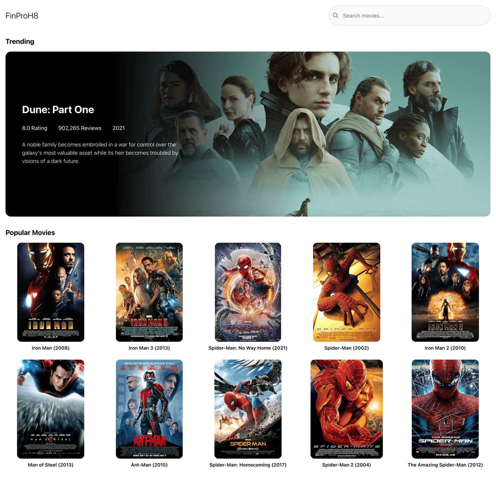
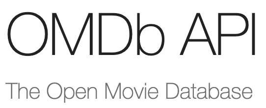

# FinProH8 | Movie Library



This is final project on Hacktiv8, simple App to show movies list

### Live

[Live here](https://h8final-hafisirsal.netlify.app/)

[](https://app.netlify.com/sites/h8final-hafisirsal/deploys)

### Configure

Get the repo

```sh
git clone https://github.com/alrafi/hacktiv8-finalproject.git
cd hacktiv8-finalproject
npm install
npm start
```

Add `.env` file to your root directory and add the following

```js
REACT_APP_API_KEY = [YOUR_OMDB_APIKEY];
```

### Powered by

[OMDB](https://www.omdbapi.com/).



### Authors

Hafis A. Irsal
